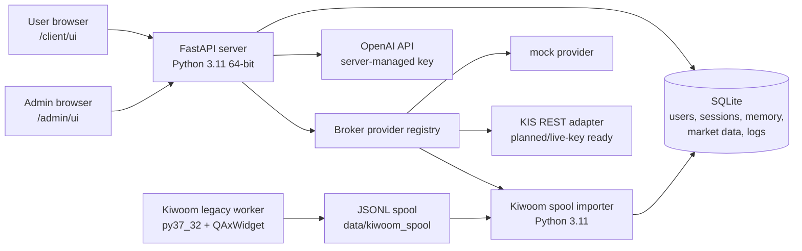

# Stock_GPT_Analysis_Server1

Private multi-user stock-analysis server that combines broker data adapters, per-user settings, encrypted credentials, operational dashboards, and OpenAI-powered analysis.

This project started from a personal Kiwoom OpenAPI+ analysis app and was split into a server-first architecture. The important engineering decision is that the main web server runs on modern 64-bit Python, while legacy Windows-only broker runtimes stay isolated behind explicit adapter and spool boundaries.

> Status: server MVP and offline validation are implemented. Live Kiwoom regular-session tick verification and external Cloudflare deployment are planned for the dedicated server PC stage.

As a student project, this repository is intentionally realistic about current constraints: full-time server operation, broker account approvals, market-hours live testing, and external infrastructure are difficult to complete immediately without a dedicated PC and stable operating budget. The value of the project is that the roadmap is already concrete: the runtime boundaries, security model, validation commands, broker abstraction, and deployment sequence are defined so the system can move from private MVP to always-on server in controlled steps.

## Portfolio Highlights

- Built a FastAPI/SQLite multi-user backend with admin and client web UIs.
- Separated shared market data from per-user memory, watchlists, settings, sessions, and broker credentials.
- Added encrypted broker credential storage with user-level provider selection.
- Implemented a disabled-by-default order request scaffold with optional approval phrase gating.
- Integrated OpenAI as a review and explanation layer, not as an uncontrolled trading trigger.
- Designed provider-neutral broker support for `mock`, Korea Investment REST, and Kiwoom legacy OpenAPI+.
- Isolated Kiwoom's special `py37_32` + QAxWidget runtime through a JSONL spool and idempotent importer.
- Added operational smoke tests for runtime, migrations, API auth, UI pages, OpenAI, and Kiwoom spool import.

## Architecture



## Implemented Features

- Multi-user account model: users, sessions, revocation, deactivate/reactivate.
- Admin UI: user lifecycle controls, request logs, GPT logs, order requests, user detail views.
- Client UI: GPT chat, watchlist management, private memory, broker provider selection, credential save flow.
- Per-user private memory: server injects user-specific context into GPT chat requests.
- Shared analysis path: common market data and analysis results can be filtered by each user's watchlist.
- Provider registry: `mock`, `kis_rest`, and `kiwoom_legacy` are selectable through a common interface.
- Secure defaults: local secrets are excluded from git; broker credentials require `CREDENTIAL_MASTER_KEY`.
- Order safety: `ENABLE_ORDER_API=0` by default; `REQUIRE_ORDER_CONFIRMATION=1` can require an exact approval phrase.
- Kiwoom legacy boundary: 32-bit worker writes realtime tick events to JSONL, Python 3.11 importer stores them in SQLite.
- Operational checks: one-command `tools/ops_check.py` runs the core offline readiness suite.

## Current Implementation Status

| Area | Status | Notes |
| --- | --- | --- |
| Multi-user auth/session | Implemented | Admin issues user tokens; inactive users lose sessions. |
| Per-user watchlist/search | Implemented | Local catalog plus DB-backed symbol search; CSV import tool exists. |
| Per-user memory/chat | Implemented | GPT context includes private memory and watchlist evidence. |
| GPT advice evidence | Implemented offline | Evidence pack includes tick summary, VWAP distance, events, report, FX slot, and paper-trade status. |
| Kiwoom live tick path | Prepared | Worker/spool/import/status/probe code exists; server-PC regular-session proof still required. |
| Paper-trade feedback | Partially prepared | Evidence pack can include `paper_trade_results` if the table is later added/imported. |
| FX context | Prepared | `.env.local` fallback exists; broker/official FX provider still needs final source selection. |
| GPT cost dashboard | Basic | Admin overview shows call count, token totals, and configurable cost estimate. |
| External access | Planned | Prefer Cloudflare Tunnel + Access after local server-PC proof. |
| Order API | Scaffolded disabled | `ENABLE_ORDER_API=0` remains the safe default. |

## Tech Stack

- Python 3.11, FastAPI, Uvicorn
- SQLite with migration scripts
- OpenAI API
- Windows PowerShell run scripts
- Kiwoom OpenAPI+ isolated in Python 3.7 32-bit
- Minimal HTML/CSS/JavaScript admin and client screens

## Repository Layout

```text
app/             application config and environment loading
server/          FastAPI app and HTTP routes
core/            database, migrations, auth, crypto helpers
broker/          provider registry and broker adapter contracts
analysis/        shared analysis pipeline
market_data/     mock and broker-backed market data access
legacy/          Kiwoom py37_32 worker and spool importer
tools/           smoke tests, ops checks, backup/status utilities
scripts/         PowerShell launchers
docs/            architecture and runtime notes
migrations/      SQLite migration SQL
data/            local runtime data, ignored by git
```

## Local Setup

```powershell
cd C:\Users\lmhk2\PycharmProjects\Stock_GPT_Analysis_Server1
C:\Users\lmhk2\anaconda3\Scripts\conda.exe create -y -n stock_server_py311 python=3.11
C:\Users\lmhk2\anaconda3\Scripts\conda.exe run --no-capture-output -n stock_server_py311 python -m pip install -r requirements.txt
```

Create local secrets:

```powershell
Copy-Item .env.local.example .env.local
notepad .env.local
```

Required for full local operation:

- `ADMIN_API_TOKEN`: admin dashboard token.
- `OPENAI_API_KEY`: OpenAI API key for real GPT calls.
- `CREDENTIAL_MASTER_KEY`: required before saving broker credentials.
- `ENABLE_ORDER_API`: keep `0` unless a broker order adapter has been reviewed.
- `ORDER_CONFIRMATION_TEXT`: exact phrase required when order confirmation is enabled.

`.env.local` is ignored by git.

## Run

FastAPI server:

```powershell
.\scripts\run_fastapi_server.ps1
```

Admin UI:

```text
http://127.0.0.1:8000/admin/ui
```

Client UI:

```text
http://127.0.0.1:8000/client/ui
```

Development fallback server:

```powershell
.\scripts\run_simple_server.ps1
```

## Validation

Core offline readiness:

```powershell
C:\Users\lmhk2\anaconda3\Scripts\conda.exe run --no-capture-output -n stock_server_py311 python tools\ops_check.py
```

Include a real OpenAI API call:

```powershell
C:\Users\lmhk2\anaconda3\Scripts\conda.exe run --no-capture-output -n stock_server_py311 python tools\ops_check.py --live-openai
```

Focused checks:

```powershell
C:\Users\lmhk2\anaconda3\Scripts\conda.exe run --no-capture-output -n stock_server_py311 python tools\runtime_check.py
C:\Users\lmhk2\anaconda3\Scripts\conda.exe run --no-capture-output -n stock_server_py311 python tools\server_pc_preflight.py
C:\Users\lmhk2\anaconda3\Scripts\conda.exe run --no-capture-output -n stock_server_py311 python tools\migration_check.py
C:\Users\lmhk2\anaconda3\Scripts\conda.exe run --no-capture-output -n stock_server_py311 python tools\fastapi_smoke_test.py
C:\Users\lmhk2\anaconda3\Scripts\conda.exe run --no-capture-output -n stock_server_py311 python tools\admin_ui_smoke_test.py
C:\Users\lmhk2\anaconda3\Scripts\conda.exe run --no-capture-output -n stock_server_py311 python tools\client_ui_smoke_test.py
C:\Users\lmhk2\anaconda3\Scripts\conda.exe run --no-capture-output -n stock_server_py311 python tools\kiwoom_spool_smoke_test.py
```

Kiwoom imported tick status:

```powershell
C:\Users\lmhk2\anaconda3\Scripts\conda.exe run --no-capture-output -n stock_server_py311 python tools\kiwoom_spool_status.py
```

## Kiwoom Legacy Runtime

Kiwoom OpenAPI+ is not loaded by the main server. It stays in a separate 32-bit runtime:

```powershell
C:\Users\lmhk2\anaconda3\Scripts\conda.exe run --no-capture-output -n py37_32 python tools\kiwoom_runtime_check.py
.\scripts\run_kiwoom_legacy_worker.ps1 --codes 005930,000660 --seconds 60
.\scripts\import_kiwoom_spool.ps1
```

The worker writes `kiwoom_tick_v1` events to `data\kiwoom_spool\kiwoom_ticks.jsonl`. The importer is idempotent by `source_event_id`, so repeated imports do not duplicate rows.

For a one-command server-PC probe:

```powershell
.\scripts\run_kiwoom_live_probe.ps1 -Codes "005930,000660" -Seconds 60 -RequireTicks
```

Personal-version lessons applied here:

- Keep Kiwoom login/QAxWidget work in one isolated process.
- Verify minimal tick collection before wiring larger analysis workflows.
- Treat after-hours login success separately from regular-session tick growth.
- Use GPT to explain risk/reward and missing evidence, while deterministic code handles collection, indicators, storage, and safety gates.

See [docs/KIWOOM_LEGACY_INTEGRATION.md](docs/KIWOOM_LEGACY_INTEGRATION.md) and [docs/SERVER_PC_SETUP.md](docs/SERVER_PC_SETUP.md) for the detailed runbooks.

## Security and Safety Notes

- This is designed for private testing with a small trusted group.
- Broker API secrets are never returned in plaintext after save.
- User tokens are issued once and stored client-side only in `sessionStorage`.
- Live order execution is intentionally disabled unless explicitly enabled and wired to a reviewed adapter.
- If exposed outside the LAN, the preferred plan is Cloudflare Tunnel plus Cloudflare Access, not raw router port forwarding.

## Current Limitations

- Korea Investment REST adapter is scaffolded, but final behavior depends on the selected account/API environment.
- Kiwoom live tick collection must be validated during a regular Korean market session on the server PC.
- Cloudflare Tunnel and Windows service/autostart setup are not finalized in this checkout.
- FX is currently manual/env based unless a broker or official provider is configured.
- Paper-trade feedback is represented in the evidence contract but needs a server-side evaluation table/source.
- SQLite is appropriate for this private MVP; PostgreSQL would be the next step for heavier concurrent usage.
- This system provides analysis support only. It does not guarantee returns and should not be treated as investment advice.

## Roadmap

1. Complete dedicated server PC setup and clone this repository.
2. Recreate `stock_server_py311` and `py37_32` environments.
3. Run offline `tools/ops_check.py` and UI smoke tests.
4. Install and verify Kiwoom OpenAPI+ in the 32-bit worker environment.
5. Run regular-session Kiwoom worker and confirm imported tick growth.
6. Configure Cloudflare Tunnel and Access for private external access.
7. Add deeper provider-specific market data paths after the final broker choice.
8. Expand analysis quality reporting with paper-trade feedback and GPT-call cost dashboards.
